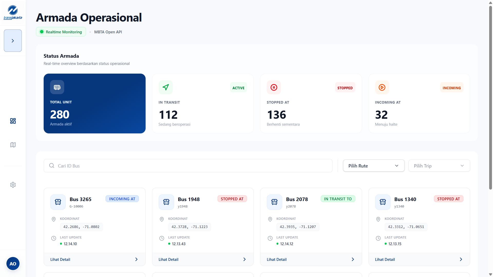

# 🚌 Transjakarta Fleet Management System

> **Frontend Engineer Technical Test Submission**
> Sebuah dashboard pemantauan armada realtime yang dibangun dengan **React**, **TypeScript**, dan **Tailwind CSS**, terintegrasi dengan Open API MBTA.




---

## 🌟 Fitur Unggulan

Aplikasi ini dirancang untuk memenuhi kebutuhan monitoring operasional dengan fokus pada performa dan pengalaman pengguna (UX).

### 1. Monitoring Realtime 📡

- **Auto-Refetching:** Data armada diperbarui otomatis setiap 10 detik tanpa reload halaman.
- **Live Status Indicators:** Visualisasi status (In Transit, Stopped) dengan kode warna yang intuitif.

### 2. Advanced Filtering & Search 🔍

- **Smart Filtering:** Filter armada berdasarkan **Rute** dan **Trip** secara spesifik.
- **Dependent Dropdown:** Dropdown Trip hanya menampilkan data yang relevan dengan Rute yang dipilih (mencegah user memilih kombinasi invalid).
- **Infinite Scroll Dropdown:** Menangani ribuan data rute/trip dengan teknik _lazy loading_ agar aplikasi tetap ringan.
- **Instant Search:** Pencarian armada berdasarkan ID Bus dengan fitur _debounce_ (mengurangi beban request ke server).

### 3. Peta Interaktif (Bonus Feature) 🗺️

- **Detail Lokasi:** Popup modal dilengkapi peta mini untuk melihat posisi spesifik satu armada.
- **Fullscreen Live Map:** Halaman khusus untuk memantau sebaran seluruh armada dalam satu peta besar interaktif.

---

## 🛠️ Teknologi & Tools

Project ini dibangun menggunakan modern stack untuk menjamin skalabilitas dan _developer experience_ yang baik.

| Kategori             | Teknologi                                                    | Alasan Pemilihan                                                                                        |
| :------------------- | :----------------------------------------------------------- | :------------------------------------------------------------------------------------------------------ |
| **Core**             | [React 18](https://react.dev/) + [Vite](https://vitejs.dev/) | Performa build cepat dan ekosistem matang.                                                              |
| **Language**         | [TypeScript](https://www.typescriptlang.org/)                | Type safety untuk mencegah runtime error dan meningkatkan maintainability.                              |
| **Styling**          | [Tailwind CSS](https://tailwindcss.com/)                     | Styling cepat, konsisten, dan file size CSS yang kecil di production.                                   |
| **State Management** | [TanStack Query (React Query)](https://tanstack.com/query)   | Mengelola server state (caching, loading, error, polling) jauh lebih efisien daripada useEffect manual. |
| **Mapping**          | [React Leaflet](https://react-leaflet.js.org/)               | Ringan, open-source, dan mudah dikustomisasi dibanding Google Maps.                                     |
| **Icons**            | [Lucide React](https://lucide.dev/)                          | Set ikon yang bersih, modern, dan ringan.                                                               |

---

## 📂 Struktur Project (Clean Architecture)

Menggunakan pendekatan **Feature-based** yang modular agar mudah dikembangkan.

```bash
transJakarta-technical-test/
├── public/                # Static assets
│   └── images/            # Image files
├── src/
│   ├── assets/            # App assets (images, fonts, etc)
│   ├── components/        # Reusable UI components
│   │   ├── layout/        # Layout wrapper (MainLayout)
│   │   └── ui/            # Atomic components (Modal, Badge, Dropdown, Card)
│   ├── features/          # Feature-specific components (Map, Sidebar)
│   ├── hooks/             # Custom hooks (useDebounce)
│   ├── pages/             # Halaman utama (Dashboard, LiveMap)
│   ├── services/          # API integration logic (Axios setup)
│   ├── types/             # TypeScript interfaces (Vehicle, Route, Trip)
│   ├── utils/             # Utility functions
│   ├── App.tsx            # Routing & Provider setup
│   ├── main.tsx           # Application entry point
│   └── index.css          # Global styles
├── index.html             # HTML template
├── package.json           # Dependencies & scripts
├── vite.config.ts         # Vite configuration
├── tsconfig.json          # TypeScript configuration
├── tsconfig.app.json      # App-specific TypeScript config
├── tsconfig.node.json     # Node-specific TypeScript config
├── eslint.config.js       # ESLint configuration
└── README.md              # Project documentation
```

---

## 🚀 Cara Menjalankan Aplikasi

### Prerequisites

Pastikan Anda sudah menginstall:

- **Node.js** (versi 16 atau lebih tinggi)
- **npm** atau **yarn** atau **pnpm**

### Langkah-langkah

1. **Clone repository**

   ```bash
   git clone <repository-url>
   cd transJakarta-technical-test
   ```

2. **Install dependencies**

   ```bash
   npm install
   ```

3. **Jalankan aplikasi dalam mode development**

   ```bash
   npm run dev
   ```

4. **Buka browser** dan akses:
   ```
   http://localhost:5173
   ```

### Scripts Tersedia

```bash
npm run dev        # Menjalankan development server dengan Vite
npm run build      # Build aplikasi untuk production
npm run preview    # Preview production build secara lokal
npm run lint       # Menjalankan ESLint untuk code quality check
```
